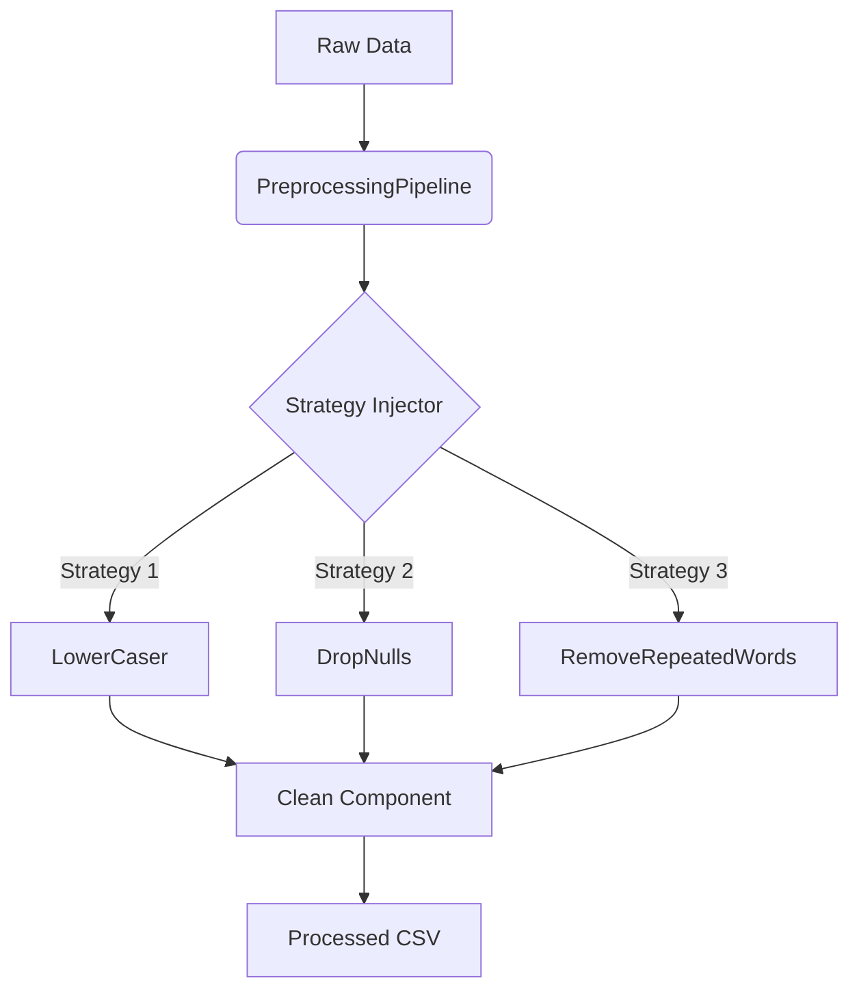
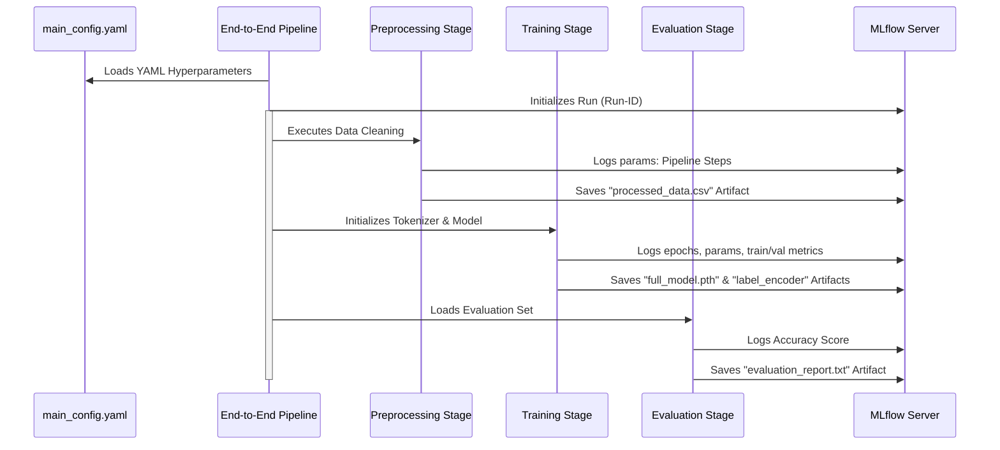

# 🚀 DeepClassifier: Advanced Enterprise MLOps Manual

This document serves as the advanced architectural guide and MLOps manual for the **DeepClassifier** project. It goes beyond quick-start instructions to explain exactly how the internal mechanics, design patterns, scalable architectures, and tracking mechanisms have been implemented.

---

## 🎯 Project Overview

**DeepClassifier** is a heavily modularized MLOps architecture designed to solve Arabic NLP text classification (Complexity and Intent). 
The project leverages the **Hugging Face Transformers** library utilizing BERT architectures (like `arabert`). Most importantly, instead of a simple flat script, it implements **Enterprise Design Patterns** to isolate data manipulation, model configuration, training iteration, and experiment tracking into separate distinct modules. 

---

## 🏗️ Architectural Core Patterns

The repository is built leveraging solid software engineering practices specifically tailored for data science workflows.

### 1. Strategy Pattern (Data Preprocessing)
Instead of rigidly hardcoding regex matching or text cleaning scripts, the data processing layer natively utilizes the **Strategy Pattern**. 
Inside `src/data/preprocessing_strategies/`, every cleaning step (e.g. `RemoveStopwords`, `LowerCaser`, `DropDuplicates`) is an isolated class inheriting a base definition. 
The top-level `PreprocessingPipeline` dictionary loads these steps dynamically. If the project requires scaling to new languages or parsing new syntax, you create a new strategy class rather than breaking existing functionality.

### 2. Unified MLflow Tracking (End-to-End Run Wrapper)
Rather than spawning disjoint experiments where data processing, model compiling, and metrics evaluation are fractured across MLflow, we operate via an **End-To-End Parent Context**. 
The `end_to_end_pipeline.py` script wraps the entire pipeline within a single active `mlflow.start_run()`. 

- **Statefulness**: Sub-pipelines dynamically detect if they are running inside this master wrapper. If so, they inject artifacts into the central context. If executed standalone, they spawn their own run.
- **Traceability**: Processed datasets, model snapshots (`full_model.pth`), encoders (`label_encoder.pkl`), and `evaluation_report.txt` all save inside local directories but are immediately logged as MLflow **Artifacts** to the singular experiment record. Versioning is natively handled structurally by MLflow Run-IDs without requiring messy file naming conventions in the paths.

### 3. Abstraction of PyTorch Boilerplate (Trainer Class)
The model training is detached from the configuration loop. 
`src/models/prepare_trainer/trainer.py` isolates the PyTorch `train()` and `eval()` phases. 
`src/pipelines/training_pipeline.py` acts solely as an orchestrator, pushing the dataset payload into the generalized `Trainer` object. 

---

## 🔄 End-to-End Orchestration Pipeline

The workflow execution relies heavily on sequential boundary definitions. When operating `run_pipeline.ps1`, the execution triggers states deterministically:

---

## 📈 Scaling Considerations

As the dataset grows or production requirements increase, the project is structured to adapt easily:

### 1. Handling Large Datasets (DVC Integration)
Presently, the original and processed CSV files live natively on-disk and artifacts are bundled via MLflow. Should the data scale beyond Git/local repository threshold constraints (e.g. going from 1GB to 50GB), the structure natively supports overriding `main_config.yaml` to point `raw_path` to cloud-storage buckets (S3/GCP) using DVC endpoints seamlessly without rewriting pipeline logic.

### 2. Multi-GPU & Distributed Training
Since the model is managed centrally within the `Trainer` class and initialized with standard `torch.device`, migrating onto Multi-GPU relies entirely on wrapping `self.model` inside PyTorch's `DataParallel` internally within the `trainer.py` initiator. No architectural rewrites are necessary across the rest of the application.

### 3. CI/CD Model Registry
Currently, we store models mapped natively to `MLruns` metadata. To deploy this to an active inference endpoint (e.g., via FastAPI), the system allows for the inclusion of the MLflow Model Registry feature. A simple webhook extension can look for the logged validation accuracy metric, and conditionally promote the saved `bert_model` path to **Production** status inherently.
